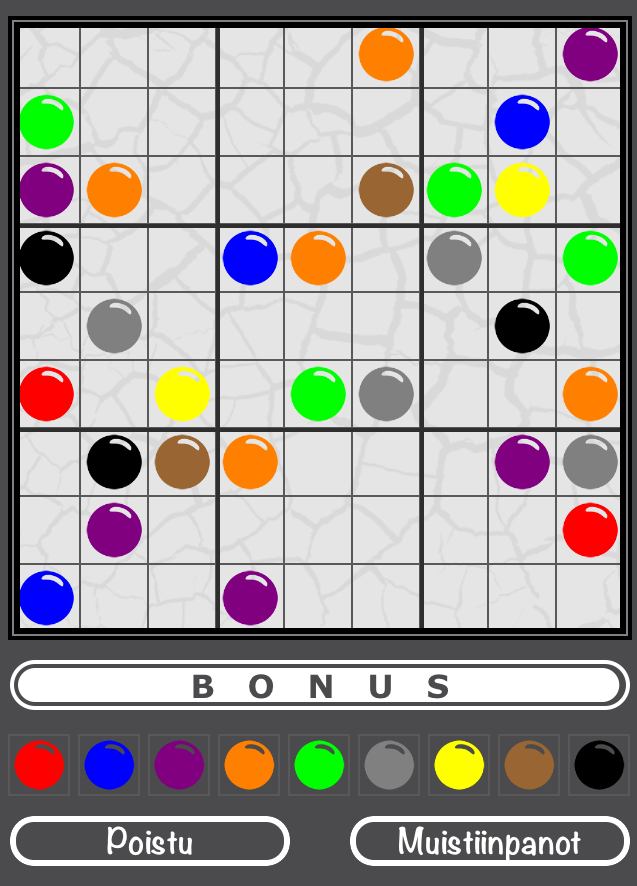

Sudoku is a fantastic grid-style puzzle game enjoyed universally on many different mediums, from computers and mobile devices through to newspapers and magazines. The idea or aim is quite simple, which is responsible for the broad interest in the game, but the mathematics behind it is complicated enough to make for a challenge when implementing it on a device.

Similarly, the interaction necessary to provide a decent experience on a desktop or mobile device requires some extra work - there needs (in my opinion) to be feedback for incorrect moves, a timer perhaps, and maybe even the option to choose to play with colours instead of numbers. None of these ideas are applicable to a Sudoku puzzle drawn onto paper, obviously, but both have to be generated and validated before being given to users to solve.

The regular Sudoku board is simple enough that it can easily fit on most mobile devices, whilst allowing the user to interact with the different cells. Typically, users can select from a group of numbers (or colours) to place in empty locations on the board, as well as selecting “notes” mode in some implementations (placeholders, usually in superscript, placed in empty boxes denoting the possible numbers - allows the user to more quickly identify the correct value for that cell). This is all UI stuff, which is trivial in implementation.

[](http://perrymitchell.net/article/building-sudoku-for-mobile-applications/ios-simulator-screen-shot-16-may-2015-5-30-48-pm/) _The Sudoku game implemented in the Aivoterveydeksi! iOS application._

The non-trivial part is the actual generation of a valid Sudoku board, complete with the correct solution. I found that when building a board generation application for use with iOS, it was incredibly slow at producing a valid board (just the complete solution) - too slow for practical use. I was iterating over the squares in the grid giving them values until I reached the last cell, checking for validity with each step (recursively). Generating a board in this manner is processor intensive and can take an arbitrary amount of time.

I scrapped the iOS build and had the idea that I could just package the application with thousands of pre-generated boards. I wrote a board generation application in C# which generates valid boards in a relatively simple manner:

*   Loop through numbers 1 to 9, placing them one-by-one into each sector (9x9 board makes 3x3 sectors). Continue until either the entire board is filled, or we can no longer place a number without it being invalid. In the case of the latter, restart the process. When complete, we have the **solution board**.
*   Remove numbers randomly from the board (for my first implementation, I chose to use a constant number of removed cells - 52) in a mirror pattern (there are many other methods of removal, but this was the easiest to implement) - if a number was removed from cell 2x2y, then its counterpart should be removed at 8x8y (mirror opposite). The resulting board with empty cells is our **puzzle board**.
*   Use a brute-force technique to attempt to solve the puzzle board - iterate through all numbers in a cell until one is valid, then recursively move on to the next empty cell and do the same. Continue until all cells are filled with valid numbers, and increment a total-solution-counter by 1\. Continue beyond this point by incrementing the numbers in each puzzle-cell by one until all combinations of numbers have been tried (time consuming), or the total-solution-counter is greater than 1 (valid boards only have 1 solution, more on this later). If this method resolves with only 1 successful solution, we have a valid puzzle.

Typically, correctly-formed Sudoku puzzles have only [one valid solution](http://www.dailysudoku.com/sudoku/faq.shtml#multi), so that is something we should watch for when generating boards. A lot of the CPU time of generating boards in this manner is in detecting (brute-forcing) solutions, and we can obviously save time by stopping when we count 2 possible solutions.

---

I released the C# code for the [Sudoku board solver on Github](https://github.com/perry-mitchell/sudoku-generator-cs). I haven't dressed it up at all, so it's still in the same condition as when I used it with the Aivoterveydeksi! project.

---

## Using generated Sudoku boards

Once we've generated a board, we're left with a file that contains two lines - the solution board and the puzzle board. Each board is made up of 81 numbers (the total number of cells in a Sudoku board), side-by-side, that read from the top-left-most cell through to the bottom-right-most cell. Empty cells on the puzzle board are represented by a 0.

> The entire 2 boards of characters take up 162 bytes on UTF-8, plus 1 byte for the new line (they're ASCII basically, so they use only 1 byte instead of UTF-8's max of 4 bytes).

In a Sudoku implementation, we can present the puzzle board to the user, and **validate their moves** by using the solution board. If the user puts a number in a cell, we can check to see if that number matches the value of the cell in the same location on the solution board. Because we know that the board has only one solution, we can safely say whether this move is correct or not.

[](http://perrymitchell.net/article/building-sudoku-for-mobile-applications/ios-simulator-screen-shot-16-may-2015-5-31-15-pm/) _An incorrect move in Sudoku on the Aivoterveydeksi! iOS application._

At this stage we have a fully functional Sudoku game, but there are some common computer-based Sudoku features that we can add easily, such as coloured pieces rather than numbers. B mapping each number to a colour, we can simply replace the number on the board with a coloured piece.




_**Left:** The Sudoku game in the Aivoterveydeksi! iOS app with coloured pieces._ 
_**Right:** The Sudoku game in the Aivoterveydeksi! iOS app with coloured pieces, notes and an incorrect move._

### Saving and Loading

One important feature you may want to include is that of a save-game. Sudoku puzzles can be monsters sometimes, and users may want to dive out of the app on mobile as they're getting off the bus, or close the window on a PC to return to it later. You don't even have to have a complicated save-game system, just save the current state when the application is to exit.

In the [Aivoterveydeksi!](http://perrymitchell.net/portfolio/aivoterveydeksi/) iOS application, we had to save the game state when the app was closed. There's a simple checklist we followed to ensure the right information was cached until the next time the game was loaded:

*   Save the **solution** and **puzzle** boards by converting them to strings and storing them in `NSUserDefaults`.
*   For each user-entered cell value, save it and whether it was correct or not.
*   Save whether the game was in numerical or colour mode.
*   Save all the notes on each cell. This can be achieved easily by providing methods on your cell class like `toNoteString()` and `fromNoteString()`. The note string format can just be comma-separated numbers.
*   If you implement a bonus bar like I did, save that as well.

When loading, you can check to see if any of this data exists in cache. Prompt the user to load it or start a new game, or simply load it automatically and provide them the option to start again.

## Difficulty levels

With Sudoku, there's the **right way** of determining difficulty, and then there's the **wrong way**.

The right way, as discussed on this [S.O. answer](http://stackoverflow.com/questions/10488719/generating-a-sudoku-of-a-desired-difficulty#25110517):

> What is standard is the minimum number (and position) of clues (which is the hardest level and which is relatd to the sudoku symmetries), then one can generate as many difficulty levels as one wants simply by allowing extra/redundant clues to be visible as well.

The number of clues, combined with some more advanced [solving techniques](http://www.kristanix.com/sudokuepic/sudoku-solving-techniques.php), can give good weight into what the difficulty of a puzzle may be.

The difficulty of a puzzle **is not determined by the number of missing (blank) cells** - this is the _wrong way_. There's so much code on the web that looks like this:

```
switch (difficulty) {
    case Difficulty.Easy: //easy difficulty
        desiredBlanks = 40;
        break;
    case Difficulty.Medium: //medium difficulty
        desiredBlanks = 45;
        break;
    case Difficulty.Hard: //hard difficulty
        desiredBlanks = 50;
        break;
    default: //easy difficulty
        desiredBlanks = 40;
        break;
}
```

This sort of Sudoku board generation leads to inaccurate difficulty ratings on many of the boards generated (taken from this [S.O. answer](http://stackoverflow.com/questions/14001935/how-to-generate-valid-sudoku-board-and-difficulty-rating)). It can be an accurate representation from time to time, but this is mostly just luck.

That being said, this less-robust method is what I'm currently using. We have a single difficulty with a constant number of blanks. The spread of **actual** difficulty around this number of blanks is enough that users may experience an easy game one time, and an insanely difficult one the next - and this is OK for us. You may decide that it's enough for you too, but I would advise (in the case that you use this less accurate method) that you try not to use the word "difficulty" in your app, because it would only be incorrect and misleading.

## In closing

When bundling your app for production, you could do like I did and package it with thousands of pre-generated boards that you randomly pick when starting a new game. You could also generate them on a server and request them when the app is started for the first time, and then periodically after that. The only important factor here is that the boards are generated off-device, so you don't run in to massive wait times. I'm open to the idea that there's much more efficient techniques at generating boards and puzzles, but the time it would take to invest in learning these would not be worth the effort - and there's still no guarantee that the more efficient solution would be a viable option for **all** mobile platforms.
