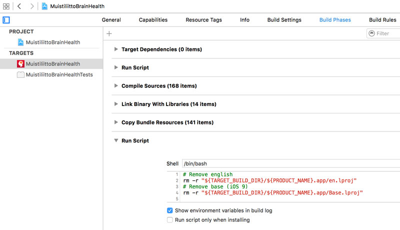

XCode provides a relatively simple method of localising your applications. You can provide translations and alternate assets for text, images, nibs etc. by clicking a couple of buttons in the interface. Where XCode fails in this process, is when it comes to managing development vs. deployment localisations.

I've been working with [Aivoterveydeksi!](http://perrymitchell.net/aivoterveydeksi/) recently to get a Swedish version released, and as I've been working iOS 9 was released - and it broke a fair bit of my setup. I develop in English, so the entire **base** of the app is in the English localisation. I then translated it into Finnish for the first release, but the intention was to only release the Finnish content and not the English.

I've managed to maintain 2 localisations in development and 1 in production by removing the English during the build process. Setting up a small script during a final **Build phase** works wonders to strip unwanted localisations:

```
# Remove english
rm -r "${TARGET_BUILD_DIR}/${PRODUCT_NAME}.app/en.lproj"
```

**iOS 9** broke this trick by removing the `en.lproj` directory (for whatever reason), and replacing it with `Base.lproj`. Adding that line to the script allows me to continue to develop in English without fear of it being released to the App store:

```
# Remove english
rm -r "${TARGET_BUILD_DIR}/${PRODUCT_NAME}.app/en.lproj"
# Remove base (iOS 9)
rm -r "${TARGET_BUILD_DIR}/${PRODUCT_NAME}.app/Base.lproj"
```

_Remember to always test and triple-check what you're actually releasing. TestFlight is a necessity when it comes to ensuring your product works on multiple devices and environments._

You can find the Build phases section in the Project navigator:


