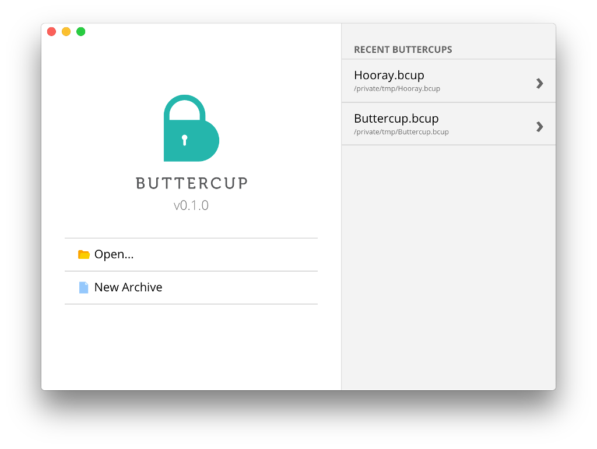
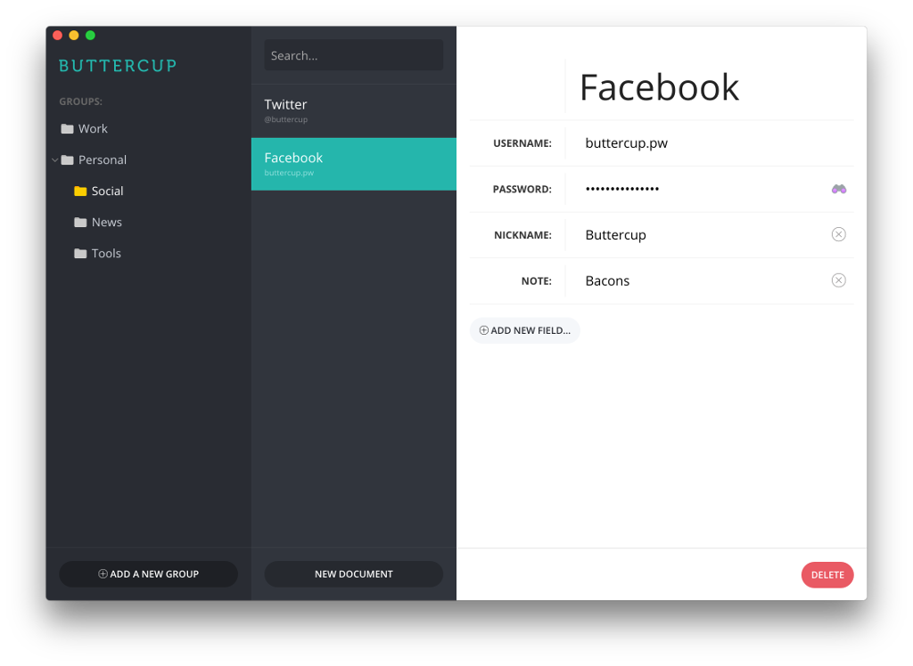

Today we released the [first version](https://github.com/buttercup-pw/buttercup/releases/tag/v0.1.0-alpha) of our cross-platform password manager, Buttercup, as an alpha release. A colleague and myself have been developing the application for many months now, and today marks an amazing achievement for us.

Buttercup is our take on what a credentials manager should be: a secure and functional application that provides a high level of accessibility (to the credentials) across every mainstream platform. The best part, in our opinion, is that it's free and open-source - something that our target competitors fail at.

We wrote Buttercup solely in JavaScript, using NodeJS with [Electron](http://electron.atom.io/) to generate the operating-system specific executables and installers.

Buttercup was born of dissatisfaction of the current password managers, which we feel suffer from one or more of the following issues:
 * They're not free
 * They're not open source
 * They lack cross platform applications
 * Their OS-specific clients lack consistency and/or quality
 * They lack decent support for interacting with remote archives
 * They provide no support for overwriting changes in a remote archive

The exact purpose of Buttercup is to address each and every one of these points - We wanted a password manager that we would want to use.

There's a lot of work to be done: We have huge plans for browser extensions, mobile applications and archive hosting solutions. We really appreciate any and all feedback, especially at this very early stage in Buttercup's development. Check out our [website](http://buttercup.pw/), Twitter feeds and [Github](https://github.com/buttercup-pw) and give Buttercup a try!
