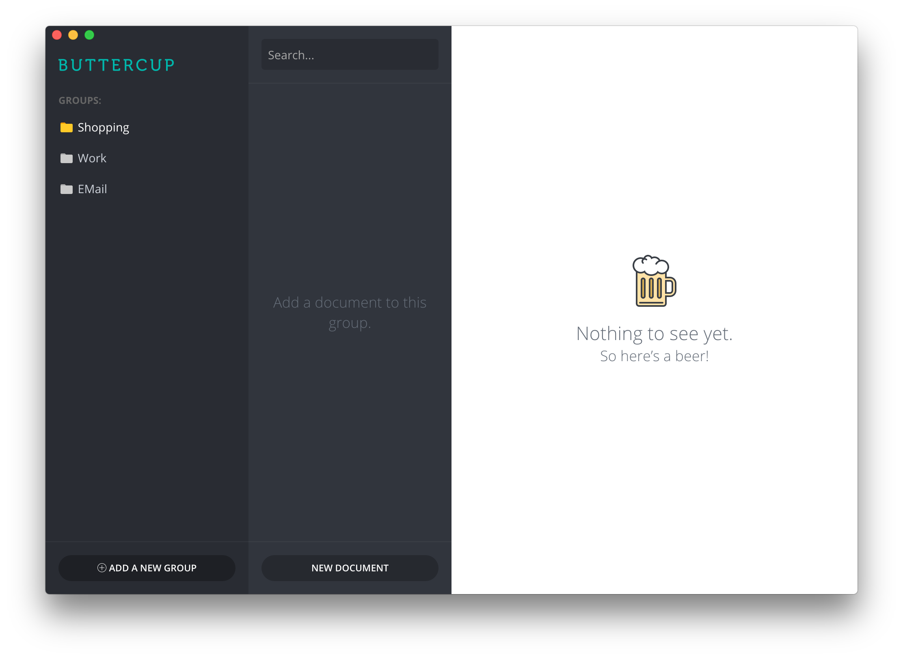

I didn't always see a need for a password manager. I used 2 basic passwords throughout school and university for most of my authenticated services, and I thought this was enough. One day I noticed that I wasn't able to log in to my account at the local computer store, and that my Hotmail account had been stolen. The computer store never admitted to it in full, but due to the fact that they were storing users' credentials in plain-text, an attacker was easily able to steal the accounts (plus some external services) of all online customers.

Since that incident I've always used a password manager - namely KeePass. Since day-one of using it, however, I've had minor issues with many parts of the application and the lack of polish therein. My colleague [Sallar](https://github.com/orgs/buttercup-pw/people/sallar) and myself started building [Buttercup](http://buttercup.pw) in September 2015 and managed to get an alpha-release of the desktop application out in January 2016. This first app is but a drop in the pool that is our plan for Buttercup as a product.

## Step 1: The desktop application
The desktop application is written, like all of Buttercup (at this point), in JavaScript (with the help of NodeJS). The actual GUI portion of the app uses [GitHub's Electron](http://electron.atom.io/) to make it easy for us to develop a professional looking cross-platform solution with minimal stress and headache.

The results so far have been amazing with an experience to match. I don't have words for how positive the feedback from the community has been thus far, and it only serves to spur me on with further development. The desktop application marks our first publicly usable portion of the product.

## Step 2: The browser extension
Password managers, in my experience, are primarily used for website logins and online services. The next important part of the eco-system is the web companion that will record logins and assist with authentication for remembered portals. Users will be able to add their archives to the extension, via whatever form of storage they choose (local, WebDAV, Dropbox, hosted etc.), and will be able to interact with authenticated systems much in the same way that other password managers behave.

## Step 3: The mobile presence
One of my biggest disappointments with KeePass is the lack of a decent mobile application. There are some 3rd-party alternatives like KyPass, but I feel that they still lack decent connectivity and a good-looking interface.

Buttercup will be available for iOS and Android primarily, and will remain free with no pro version. Working off the same strength of having a single codebase for the desktop application, the mobile build will use a cross-platform solution to ensure consistency in experience and updates.

## Step 4: The hosted service
Buttercup will eventually get a hosted platform where users can choose to store their archives without having to worry about hosting it themselves. This solution isn't for everyone, but we feel that it's a necessary concept to round-off the entire product pool.

Great care will be taken to ensure anonymity and security, and we feel that this would be a great platform to introduce new users to Buttercup. The goal at this stage is to make the service free for individuals, and to charge businesses for corporate use.

## The long road ahead
There's a ton of work to be done, but this is open-source that we're talking about. With the help of the community, we know that Buttercup will become a mature and trusted credential manager in no time. There's a vast array of features we plan to add to each component along the way, including support for remote archive hosting (cloud storage providers etc.).

What can be open-source will remain so, but certain parts of the platform (such as the mobile apps) will have to be kept private for publishing reasons. The core and encryption/decryption functionality will remain in public view, and the items I've described here will remain free for the life of the product.

## How is Buttercup different?
We've been often asked how it's different and why we're bothering to build a new password manager. Buttercup is:
 * a free application
 * open source
 * available for all mainstream platforms
 * unified codebase and language
 * targets all cloud-storage providers for easily hosted remote archives

If you're curious to see what we're up to, we're active in a number of different areas: [Twitter](https://twitter.com/buttercup_pw), [buttercup.pw](http://buttercup.pw), [GitHub](https://github.com/buttercup-pw).
