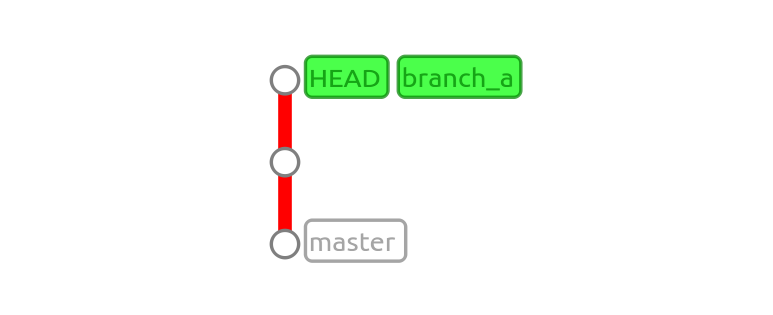
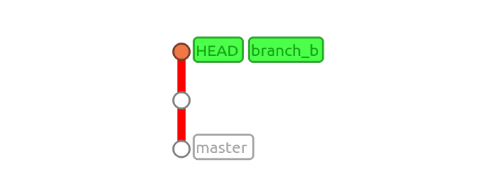
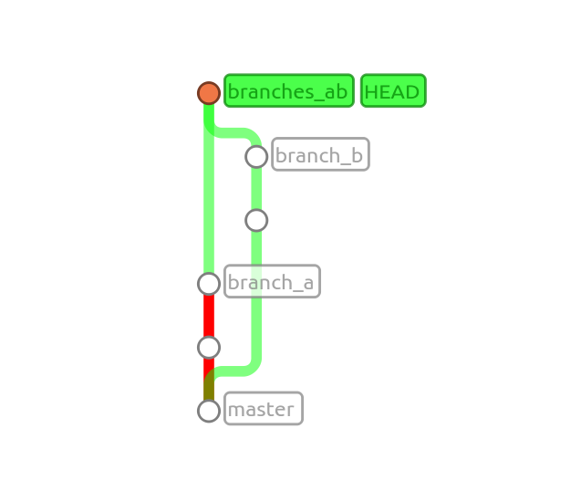
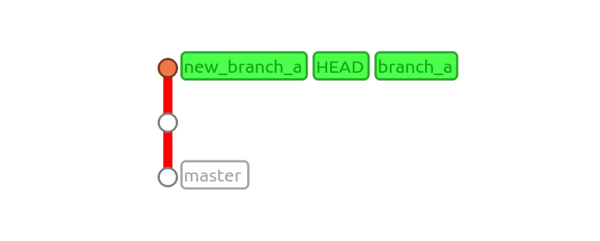

A colleague of mine found themselves in a bit of a mess recently when they lost themselves in some ambiguous commits and merges. When you spend days or weeks on a task with tens of commits it's quite easy to lose track of exactly where you stand. After pulling and merging from another branch, my colleague noticed that this had not been the desired result, and a revert was necessary... But how do you revert a merge?

*In this post I'll walk you through creating a couple of branches, merging them, and then rolling back to before the merge. It's quickly visible just how the commit revisions can be used to move around very easily like on a timeline.*

When running `git log`, merged commits state that they are, in fact, a merge:
```
commit 2b6fb3dfe3a2d45fedbf5785c3525a1509f87bdf
Merge: f07e89b 5943f1e
```

The revisions listed on the merge line are the two parents of the merge-commit. Merges are simply a commit detailing that two branches are becoming one (or that one branch is joining the current).

### Setting the stage
Let's run an experiment: two branches with their own changes and commits, merged together at the end. The merge at the end will be our merge-commit which we can relate to my colleagues problem.

Firstly, I'll setup a repository and make an initial commit:
```
$ git init
Initialized empty Git repository in /home/perry/test/.git/

$ echo "This is my file" > initial.txt
$ ls
initial.txt

$ git add initial.txt
$ git status
On branch master

Initial commit

Changes to be committed:
  (use "git rm --cached <file>..." to unstage)

	new file:   initial.txt

$ git commit
[master (root-commit) aa76362] Initial
 1 file changed, 1 insertion(+)
 create mode 100644 initial.txt
```

Our experiment is underway:


We're in master at the moment, so I'll create a new branch with some action:
```
$ git checkout -b branch_a
Switched to a new branch 'branch_a'

$ echo "Second line" >> initial.txt
$ cat initial.txt
This is my file
Second line

$ git commit -a
[branch_a 04c67eb] Second line (branch a)
 1 file changed, 1 insertion(+)

$ echo "Another file, branch a" > first.txt
$ git add first.txt
$ git commit
[branch_a f07e89b] Added first.txt (branch a)
 1 file changed, 1 insertion(+)
 create mode 100644 first.txt
```

So if we check out our recent history, we can see something like this:


Now let's go back to master and make another branch. We'll do some work over there too before we merge them together:
```
$ git checkout master
Switched to branch 'master'

$ git checkout -b branch_b
Switched to a new branch 'branch_b'

$ echo "Second line from branch_b" >> initial.txt
$ cat initial.txt
This is my file
Second line from branch_b

$ git commit -a
[branch_b 4619b91] Second line in initial (branch b)
 1 file changed, 1 insertion(+)

$ echo "Another file from branch b" > second.txt
$ git add second.txt
$ git commit
[branch_b 5943f1e] Added second.txt file from branch b
 1 file changed, 1 insertion(+)
 create mode 100644 second.txt
```

Let's check out how it looks over this side:


### Recreating the scene
Now that we've prepared our branches, let's go back to `branch_a` and merge `branch_b` into it:
```
$ git checkout branch_a
Switched to branch 'branch_a'

$ git checkout -b branches_ab
Switched to a new branch 'branches_ab'

$ git merge branch_b
Auto-merging initial.txt
CONFLICT (content): Merge conflict in initial.txt
Automatic merge failed; fix conflicts and then commit the result.
```

Whoops! I've tried to merge `branch_b` into `branch_a` and there's been changes that git can't automatically insert. Let's take a look at the conflict:
```
This is my file
<<<<<<< HEAD
Second line
=======
Second line from branch_b
>>>>>>> branch_b
```

This is an easy fix - I want all of that content. I can simply remove the merge lines:
```
This is my file
Second line
Second line from branch_b
```

And all I need to do then is add and commit the conflict resolution:
```
$ git add initial.txt
$ git status
On branch branches_ab
All conflicts fixed but you are still merging.
  (use "git commit" to conclude merge)

Changes to be committed:

	modified:   initial.txt
	new file:   second.txt
```

If I then commit the fix I made, I'll get a nice message about the conflict pre-filled for me. I recommend leaving the message as-is, as your colleagues will be able to easily see that you performed a merge and that there were 'problems'.

So let's commit:
```
$ git commit
[branches_ab 2b6fb3d] Merge branch 'branch_b' into branches_ab
```

Our history will now look quite fancy with two branches becoming one:


**So now we've recreated our situation as we were discussing earlier**. We're in our branch with the changes from both previous branches merged together:
```
$ git log --oneline
2b6fb3d Merge branch 'branch_b' into branches_ab
5943f1e Added second.txt file from branch b
4619b91 Second line in initial (branch b)
f07e89b Added first.txt (branch a)
04c67eb Second line (branch a)
aa76362 Initial
```

### Cleaning up
For the sake of the example, we can pretend that there are no other branches other than the new one that we're on. In the case that we would want to go back to before we merged in `branch_b`, we have but to look at our most recent commit:
```
commit 2b6fb3dfe3a2d45fedbf5785c3525a1509f87bdf
Merge: f07e89b 5943f1e
Author: Perry Mitchell
Date:   Thu Feb 11 18:39:21 2016 +0200

    Merge branch 'branch_b' into branches_ab

    Conflicts:
        initial.txt
```

The two revisions listed on the merge are the two parents we saw before:
```
5943f1e Added second.txt file from branch b
f07e89b Added first.txt (branch a)
```

These two commits mark the last commits on both of the *previous* branches. Using `git checkout`, we can simply rewind to one of these two points in time. Moving back to one or the other will effectively remove the changes of the merge, placing your local copy in that prior state:
```
$ git checkout f07e89b
Note: checking out 'f07e89b'.

You are in 'detached HEAD' state.

...

HEAD is now at f07e89b... Added first.txt (branch a)
```

A quick log will show us the fruits of our time-travel:
```
$ git log --oneline
f07e89b Added first.txt (branch a)
04c67eb Second line (branch a)
aa76362 Initial
```

Perfect! No more `branch_b`. Without damaging our consolidated branch, we can simply roll this current state into a new safe branch (effectively giving birth to a cloned `branch_a`):
```
$ git checkout -b new_branch_a f07e89b
Switched to a new branch 'new_branch_a'

$ git log --oneline
f07e89b Added first.txt (branch a)
04c67eb Second line (branch a)
aa76362 Initial
```



In this article we:
 * Made 2 branches
 * Made commits on both branches
 * Created a new branch from **a** and merged **b** into it
 * Rewound to a previous commit before the merge and recreated a new clean branch

We saw that each commit is a point in time - a record of changes in the history of a project. With git, almost nothing is final and there's usually always a possible action to take to reverse unwanted changes. Merges can be messy, but with git we're able to check out a previous revision to effectively roll-back our actions.

If things like this occur often for you, often a small change in git-behaviour can help reduce the number of frustrations you deal with on a weekly basis. Providing it's safe and suits your team's workflow, pushing often can mean your local copy is somewhat more disposable. Having another clean copy of your code (in another branch or origin) is a great way to lessen the impact of erroneous merges or commits.
