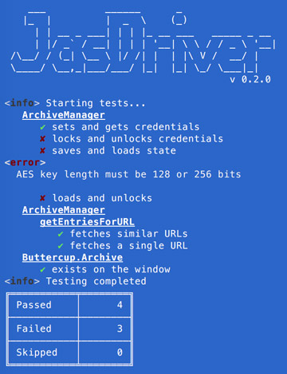

I've been testing my projects with [PhantomJS](http://phantomjs.org/) for a long time now. Phantom is a headless browser, and it makes interacting with a DOM easy to script.

Headless browsing has a ton of uses besides testing, too, such has scraping (search engines for example) and form automation. Once you've pointed a headless browser like Phantom to a page of choice, it's somewhat trivial to instruct it to perform operations on the page, like running JavaScript.

The ability to execute code, like on a real webpage, makes PhantomJS a fantastic candidate for JavaScript testing - especially because it requires no graphical interface to run.

## Judging by its cover
PhantomJS looks great on the outside - and I love using it for a wide variety of my projects for testing - but its core is old and disheveled. Check out [its ES6 support table on Kangax](https://kangax.github.io/compat-table/es6/#phantom) (the red column is Phantom's):

[](https://kangax.github.io/compat-table/es6/#phantom)

I've even been using it at work, until now. Kiosked's front-end JS libraries are all ES6 transpiled to ES5 so we support a decent percentage of our target market, so usually using something as outdated as PhantomJS isn't a problem.

Issues arise when libraries become more complex, and build processes are further abstracted. Webpack with Babel means we can get a lot of optimisations done during the build process with little cost to development complexity, though this means that when issues do arise, they're a nightmare to debug in a headless browser. `debugger` statements, breakpoints and interactive stack-traces are not as easy as in a proper browser, so more time is taken fixing them.

## No comparison
At the end of the day you can't really compare PhantomJS and other tools like Webdriver (Selenium), as they're built to perform a different set operations and tasks. As for testing, however, they're well and truly on the same page.

Whereas PhantomJS uses WebKit (QtWebKit) under the hood and is essentially its own browser, Webdriver simply wraps a browser instance so it can be controlled via a common API so the browser backend is mostly interchangeable. This makes Webdriver a fantastic tool that enables scalable testing in a [multitude of _real_ environments](http://www.chrisle.me/2013/08/5-reasons-i-chose-selenium-over-phantomjs/).

## Lack of features
Sure, if you transpile your code, testing on Phantom is probably fine. There are, however, a number of browser built-ins that don't work on Phantom. One of these neglected packages is web crypto, which I use in my [Buttercup](https://buttercup.pw) - we transpile using Babel and Webpack so we can use our NodeJS application in the browser, but web crypto is a special beast which doesn't perform well after bring polyfilled. For some features, we need real crypto operations (like password hashing for [PBKDF2 implementations](https://github.com/buttercup-pw/buttercup-core-web/commit/3770deb0535be3261bda407471dfc5f2594ae28d#diff-3f4121a517150f2bf6a9e4e4643ec889R27)).

Since Phantom doesn't support web crypto, and polyfilling it simply results in exponentially longer hashing times (minutes rather than milliseconds), my only option is to migrate my testing setup so that it utilises a real browser with native web crypto.

## No more difficult
I recall years ago bashing the idea of Selenium because I felt the complexity of some applications was too much to expect Webdriver and Selenium's automation to handle. I can't speak on the automation side of things just yet, but my most recent experience with Webdriver has shown me just how easy it's become.

It was so easy, using WebdriverJS, that I decided to write an application called [JasDriver](https://github.com/perry-mitchell/jasdriver) (which is also on [npm](https://www.npmjs.com/package/jasdriver)). JasDriver runs a Webdriver instance with [Jasmine](http://jasmine.github.io/) injected into an empty page. It then allows, through simple configuration, the setup and testing of web-based applications.

[](https://www.npmjs.com/package/jasdriver)

## JasDriver vs PhantomJS
So, how does JasDriver compare in terms of testing? Back when I was actively using GruntJS to automate many of my development tasks, I would use [grunt-contrib-jasmine](https://www.npmjs.com/package/grunt-contrib-jasmine) to setup my testing suite (which uses Phantom). It was quite painless and it also used a very simple configuration:

```
grunt.initConfig({
    jasmine: {
        kiosked: {
            src: 'source/**/*.js',
            options: {
                specs: 'tests/**/*.spec.js',
                helpers: 'tests/setup/*.helper.js'
            }
        }
    }
});
```

Running `grunt test` would start Phantom and the begin running Jasmine tests, reporting on the outcome at the end. Any polyfills etc. would be added and built into the library before testing began (via webpack etc.).

Going forward, one would hope that transitioning to a new toolset (Jasdriver, Webdriver & a real browser) would result in as simple a configuration as what I've just presented. The good news is it **can** be just like that - here's my current JasDriver configuration:

```
module.exports = {
    specs: [
        __dirname + "/build/buttercup.js",
        __dirname + "/tests"
    ],
    webdriverBrowser: "chrome"
};
```

Once I've setup my `package.json` test:

```
{
    "scripts": {
        "test": "jasdriver"
    }
}
```

The output of `npm test` shows our test results:

[](https://www.npmjs.com/package/jasdriver)

JasDriver comes pre-loaded with the latest version of Jasmine, and can be configured to use any browser the latest version of Webdriver supports.

_Webdriver supports Firefox out of the box, and JasDriver includes Chromedriver so Chrome can be used as well._

## The outcome
Using JasDriver with Webdriver, Chrome, Webpack and Babel makes for a fantastic and modern project environment where features can be developed quickly, tested automatically and setup to provide a simple and productive debugging environment.

JasDriver also plays nicely with CI servers like Travis, providing you setup the [configuration correctly with xvfb](https://github.com/perry-mitchell/jasdriver/blob/2bca60910225022f6f53a26adc8eb948c59f00b1/.travis.yml) (I had it work once [with Chrome](http://blog.500tech.com/setting-up-travis-ci-to-run-tests-on-latest-google-chrome-version/), but I haven't been able to reproduce that working case due to installation issues on Travis servers).
