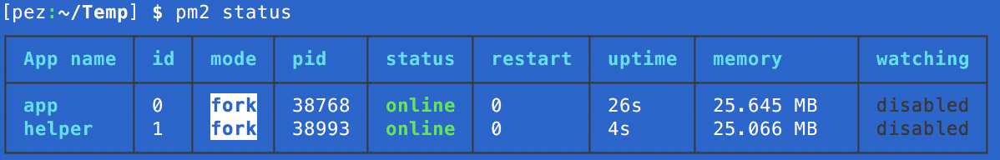
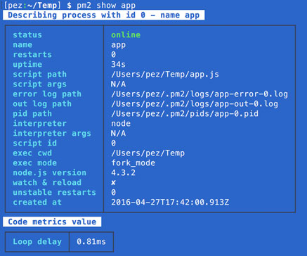
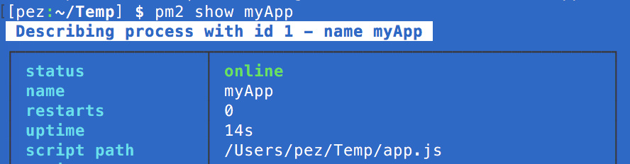
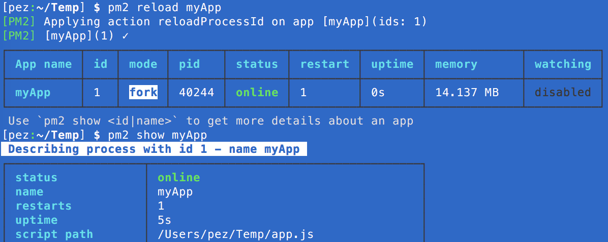

At work, we recently started using our first NodeJS service in production. We also have another couple of Node servers, all of which are being kept online using [PM2](https://www.npmjs.com/package/pm2). PM2 is pretty fantastic at managing running Node applications and clusters, and it provides quite an attractive interface when you're checking stats:

[](pm2status.jpg)

[](pm2statusapp.jpg)

You can boot your app with PM2 easily by just passing it to the start command: `pm2 start app.js`, or you can write a JSON config for it and start that:

```
{
    "name": "myApp",
    "script": "app.js",
    "cwd": "/home/user/",
    "env": {
        "NODE_ENV": "production",
        "APP_ENV": "staging"
    },
    "out_file": "/var/log/app.log",
    "error_file": "/var/log/app.error.log"
}
```

`pm2 start app.json`

You end up with something like the following:

[](pm2online.png)

Problems arise when you modify the JSON config - let's change the script name, for example, from `app.js` to `app2.js`. Restarting shows the following:

[](pm2online2.png)

Notice how the name of the script hasn't changed, despite us changing it in the JSON configuration which we reloaded. Even running `pm2 startOrReload app.json` (which is documented as _"startOrReload <json> - start or gracefully reload JSON file"_) yields no changes.

This is effectively where we got with our applications in production - unable to change log file locations, environment variables and application paths without doing something like `pm2 delete app && pm2 start app` (no longer 0s downtime).

## Enter upstart
Due to the failings of PM2, we opted to go back to a more mature platform (and one that our other non-node services have been using for some time already) - **upstart**. Writing a simple config for upstart is dead easy:

```
start on filesystem and started networking
respawn

env NODE_ENV=production
env APP_ENV=staging

exec /usr/local/bin/node /home/user/source/index.js
```

This config can then be dropped in to `/etc/init` as `app.conf` and then started using `sudo start app`. Now, when deploying, we can simply run `sudo restart app || sudo start app` to ensure the application is restarted. We're also using a symlink to point to the configuration file in the deployment directory, so we have to run `sudo initctl reload-configuration` beforehand.

This has proven to be a much simpler approach with fewer dependencies - upstart comes pre-installed and ready to run our application config without prejudice.

## Why didn't you fix PM2?
I haven't yet filed a bug or attempted to patch PM2 due to time restraints, but I do plan to follow up here with the progress of such actions. PM2 is a fantastic application which deserves its popularity - no tool is exempt from bugs.
