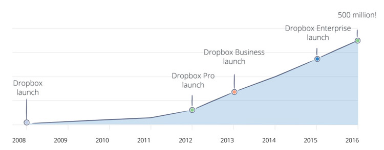
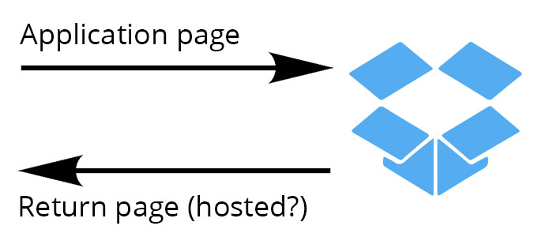

As part of the [Buttercup](https://buttercup.pw) application suite we're building a browser extension (starting with Chrome). Browser extensions can be tricky, as they entail building many different moving pieces that need to interact with each other in somewhat different environments within the browser.

Chrome has, for instance, 4 main parts that make up an extension:

 * Content scripts, which run within browsed-to pages (JavaScript)
 * Popup pages, which run when clicking the extension icon in the toolbar (HTML/CSS/JavaScript)
 * Extension pages, which can be browsed to on demand (HTML/CSS/JavaScript)
 * Background scripts, which run in the background (single instance) (JavaScript)

Using these different components you can create extremely useful and engaging applications for Chrome - such is the hope for our [browser extension for web authentication](https://github.com/buttercup-pw/buttercup-browser-extension). One useful feature we've wanted for our software is **the storage of password archives within Dropbox**. The key to an effective credentials manager, we feel, is portability and accessibility, and hosting the secure archive on cloud-based infrastructure makes a user's credentials highly accessible.

We chose to include [ownCloud](https://owncloud.org/) and WebDAV support primarily as these are open technologies like ours, but as Dropbox has a huge amount of active users, it was the next logical choice.


[_Dropbox reaches 500 million users_](https://blogs.dropbox.com/dropbox/2016/03/500-million/)

## Accessing Dropbox using JavaScript
Dropbox offer a [JavaScript SDK](https://github.com/dropbox/dropbox-sdk-js) which does all the hard work in authenticating and interacting with Dropbox accounts and files. Reading and writing files is quite trivial (check out [dropbox-fs](https://github.com/sallar/dropbox-fs)), but authentication is a bit trickier and involves going off-site to allow the user to grant access to the application.

Now there isn't really anything inherently complex about this authentication mechanism by itself, but it gets a bit more complicated when you have to manage the authentication cycle from within the Chrome extension structure. Dropbox requires redirecting the user to a _dropbox.com_ page to ask them if they want to allow access to the application, and then redirects back to a **hosted page** with an authentication token (which is used for further interaction).



Basically, you need to know (in advance) what the return URL should be once Dropbox has authorised the access request. This is trivial when developing web applications, but some care needs to be taken when working with Chrome's tenuous extension URLs. Extension URLs are randomly generated for extensions per application:

```
chrome-extension://acjcajjalpgmagfnbenbdnikfpohgnij/setup.html#/?_k=bt5c0m
```

Generating these are quite simple, however, but the problem lies with the `chrome-extension://` prefix - Dropbox simply doesn't allow it and will reject requests made with these URLs. Secondly, if you're using a routing mechanism like [React Router](https://github.com/reacttraining/react-router), you might run in to trouble using fragment paths (eg. `#/some/path`) as Dropbox will redirect back with a whole lot of junk in the fragment (breaking the router).

For Buttercup's extension we got around these limitations by simply having Dropbox **redirect to our own website** - `https://buttercup.pw`. Sure, the page isn't explicitly part of the extension, but if we run a content script on that page, we can catch the returned authorisation data:

 1. Generate URL using Dropbox SDK, specifying return page address
 2. Open a new tab with Dropbox-generated URL
 3. User authenticates
 4. Page is redirected to desired return page
 5. Content script reads token from URL fragment
 6. Content script signals to background script to close the tab

Let's take a look at steps **1** & **2**:

```javascript
/* From our background script */
const DropboxClient = require("dropbox");

// new Dropbox client
let client = new DropboxClient({
    clientId: "my-client-id"
});

// specify callback and generate Dropbox-side URL
let callbackURL = "https://buttercup.pw/",
    dropboxURL = client.getAuthenticationUrl(callbackURL);

// open new tab
chrome.tabs.create({ url: dropboxURL });
```

Here we do the initialisation work, and hand off the final part of the authorisation to the Dropbox service. Dropbox will redirect to the callback URL with a format like so:

```
https://buttercup.pw/#access_token=XJI39F8na73BBBAABCLxcMq8AbSD7ye3eZhykesdficj90Kn7Qc4x8hj324cH8EW&token_type=bearer&uid=999999&account_id=dof98CjSAD0bnd8VaUkmqvsSDKJe82CJqXGyXC-b8H
```

Once we detect that we're on our target page using a content script, we can test for the access token:

```javascript
if (/^https:\/\/buttercup\.pw/i.test(window.location.href)) {
    let match = /access_token=(\w+)&/.exec(window.location.hash);
    if (match) {
        let accessToken = match[1];
        // do something with access token
        // close tab:
        chrome.runtime.sendMessage({ command: "close-tab" }, function() {});
        // listener on background script simply calls the following:
        //      chrome.tabs.remove(sender.tab.id);
    }
}
```

This is a rather foolproof way of capturing the token within a Chrome extension. We use an own, trusted site to simply be the target of redirection and we scrape the result from there if it exists. Within the Buttercup extension we use a Promise to [wait for the token to be set](https://github.com/buttercup-pw/buttercup-browser-extension/blob/bff76d78db7233485e8cd05b72f60abb64fc3781/source/background/DropboxAuthenticator.js#L29) before moving on in the program's flow.
