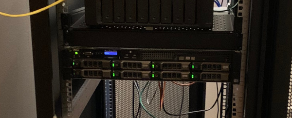

I've been expanding my range of server hardware at home for some years now - this accelerated after I moved to Finland. The market for used workstation and server hardware is fantastic in Europe - especially in Germany. Because of the huge range of cheap machines, I opted to buy a used Dell R720 rack server from ebay Germany and then proceeded to mount it in my new rack cabinet I'd purchased earlier.

The R720 is a fanstastic 2U beast of a server, and mine boasts dual 8-core (16 thread) Xeons with a massive 128GB of RAM. It's more than I need to run all of my VMs and projects, which is why I chose it (for future proofing). That, and it allowed me to house 8x 4TB HDDs in the front for easy access. I have a Synology with about 17TB usable in it, but I needed the extra space for VM workloads... Oh yeah :D

All of this power crammed into this short 2U chassis comes at a price - it's cooling design. Don't get me wrong, it's _highly effective_ at cooling itself - the fans spin at absolutely mental speeds to push a ton of air through the case - but the noise level associated with the fans moving at these high speeds is prohibitively loud.

I knew that when I bought the R720, that it was designed for an air-conditioned server room.. not my home office. There are hundreds of Reddit posts discussing this, over and over again, year in year out - rack servers are loud af. But this point.. the _actual_ noise level is hard to estimate until you have the thing running beside you. What's better, too - is that upon first boot the fans will usually spin up to 80-100% of their max power.. This scared the shit out of me the first time I pressed the power button.

My wife was close by when I did this. I had explained to her earlier that it will be loud.. louder than she might expect.. but that I'll be able to tune it to remain at a more comfortable level (so that she'd not notice it - LOL). Right away, when I turned it on, her look said it all - she absolutely _knew_ that the originally promised level of noise was impossible to attain. She has know idea of the technology in that machine - but she knew that I'd overpromised bigtime. At this stage I don't think it's necessary to state just how patient a woman she is.. to even let me get this far 😅.

Anyhow - the beast spins up and the fans just behind the HDD caddies hit maybe 70-75% fan speed. This is already crazy loud, with conversations nearby containing a whole lot of **"what?"** and **"huh?"**. It's loud enough that working beside such a thing for any period of time is very much unappealing. After a couple of seconds though, the R720 goes full-boar and spins the fans up to near-max... The curtains on the wall behind my rack cabinet are 45-degrees in the wind and I can see parts of my wall behind them I hadn't seen before.

The R720 will keep the fan speed in this high range until some software comes along that can coerce it into lowering them because it'll probably remain cool enough. I didn't have such luck, however, as installing Proxmox (virtualisation hypervisor) didn't change a thing. So after powering the wind tunnel off so I could hear myself think - I did some research and discovered IPMI.

IPMI (Intelligent Platform Management Interface) is a method for interacting with a server or machine remotely for administrative purposes. One such use of IMPI is fan and thermal control/monitoring, and Dell servers allow you to interact with the fans and their speed settings when using IPMI. This is great - because it means I can fall back to manual control when the software I use (or the server itself) chooses not to ramp down the fans to an audibly-friendly level. I ended up writing a bash script, which runs in a CRON job, to automate the fan control for the R720.

The script first queries the temperatures across the server's sensors, decides upon an appropriate speed setting (in %), and then sends the adjusted setting back to IPMI. If it detects a hotter temperature than it's programmed to handle, or if it receives an invalid value, it relents control and lets IPMI spin the fans up to whatever speed it deems appropriate.

It's not ideal, for several reasons:

 * It's timed - so there's a potential delay between the temperature ramping up and the script running.
 * It's network-dependent - so if there's a DNS issue or outtage it won't be able to communicate with IPMI.
 * It's stepped - finer grain control of the fans might result in better performance.

So because of these reasons I'll probably opt for rewriting the solution in NodeJS or something, at some stage. That won't solve the network issue but I've so far not seen many/any outtages that would've resulted in longer periods without control.

Another idea is to attach this process to Nagios so you receive alarms, and to graph it with Graphana or something similar.

I have this script running under a CRON job on an LXC container on Proxmox - so it's more or less controlling itself. I've managed to get the fans down to something which isn't quite unnoticable, but it's much closer to just being a loud PC. I'd highly recommend taking this route if you plan to run a rack server at home.
